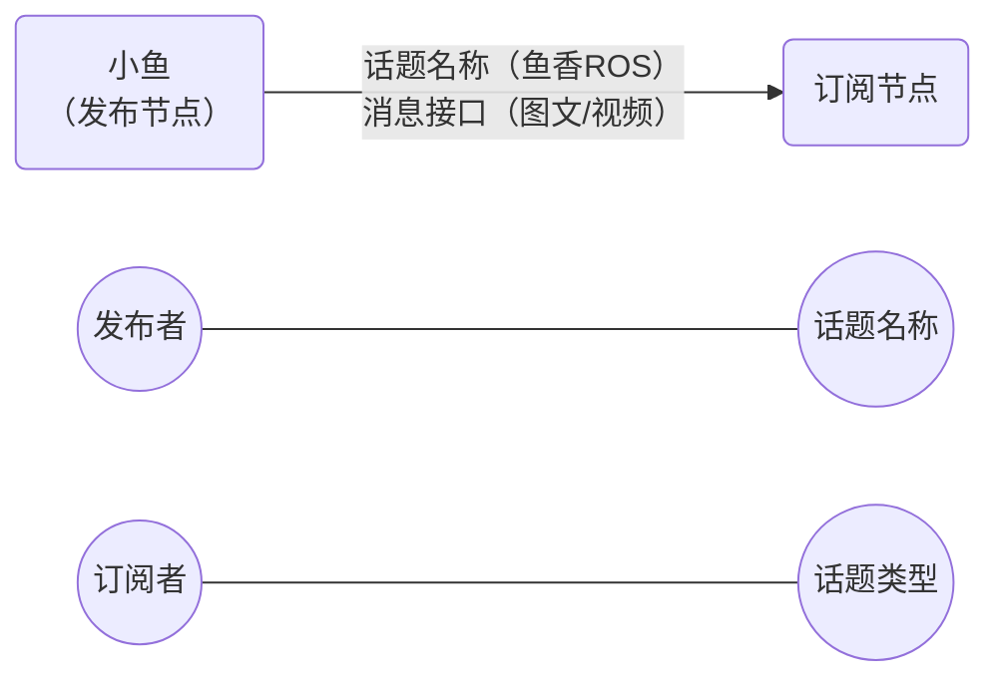

#topic



## python

```bash
# 增加依赖
ros2 pkg create demo_python_topic --build-type ament_python --dependencies rclpy example_interface --license Apache-2.0

# 查看接口
ros2 interface list | grep -i example
# 查看内容
ros2 interface  show example_interfaces/msg/String 

# 查看话题内容
ros2 topic echo /novel
# 查看话题频率
ros2 topic hz /novel
```