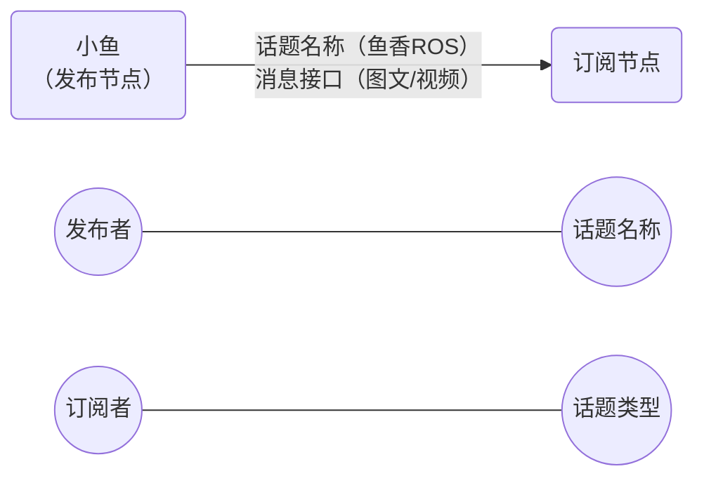

#topic



## python

```bash
# 增加依赖
ros2 pkg create demo_python_topic --build-type ament_python --dependencies rclpy example_interface --license Apache-2.0

# 查看接口
ros2 interface list | grep -i example
# 查看内容
ros2 interface  show example_interfaces/msg/String 

# 查看话题内容
ros2 topic echo /novel
# 查看话题频率
ros2 topic hz /novel
```

## c++

```bash
# 注意路径
cofallen@cofallen-NucBox-M6:~/Code/ros2/cp3_topic/topic_ws/src$ ros2 pkg create demo_cpp_topic --build-type ament_cmake --dependencies rclcpp geometry_msgs turtlesim --license Apache-2.0
```

```bash
# 查看话题发布情况
cofallen@cofallen-NucBox-M6:~$ ros2 topic list
/parameter_events
/rosout
/turtle1/cmd_vel
/turtle1/color_sensor
/turtle1/pose
cofallen@cofallen-NucBox-M6:~$ ros2 node list 
/turtle_circle
/turtlesim
cofallen@cofallen-NucBox-M6:~$ ros2 node info /turtle_circle 
/turtle_circle
  Subscribers:
    /parameter_events: rcl_interfaces/msg/ParameterEvent
  Publishers:
    /parameter_events: rcl_interfaces/msg/ParameterEvent
    /rosout: rcl_interfaces/msg/Log
    /turtle1/cmd_vel: geometry_msgs/msg/Twist   # 发布者
  Service Servers:
    /turtle_circle/describe_parameters: rcl_interfaces/srv/DescribeParameters
    /turtle_circle/get_parameter_types: rcl_interfaces/srv/GetParameterTypes
    /turtle_circle/get_parameters: rcl_interfaces/srv/GetParameters
    /turtle_circle/list_parameters: rcl_interfaces/srv/ListParameters
    /turtle_circle/set_parameters: rcl_interfaces/srv/SetParameters
    /turtle_circle/set_parameters_atomically: rcl_interfaces/srv/SetParametersAtomically
  Service Clients:

  Action Servers:

  Action Clients:

cofallen@cofallen-NucBox-M6:~$ ros2 topic echo /turtle1/cmd_vel
linear:
  x: 1.0
  y: 0.0
  z: 0.0
angular:
  x: 0.0
  y: 0.0
  z: 0.5
---
linear:
  x: 1.0
  y: 0.0
  z: 0.0
angular:
  x: 0.0
  y: 0.0
  z: 0.5
---
linear:
  x: 1.0
  y: 0.0
  z: 0.0
angular:
  x: 0.0
  y: 0.0
  z: 0.5
---
linear:
  x: 1.0
  y: 0.0
  z: 0.0
angular:
  x: 0.0
  y: 0.0
  z: 0.5
---
linear:
  x: 1.0
  y: 0.0
  z: 0.0
angular:
  x: 0.0
  y: 0.0
  z: 0.5
---
```


内层调用过程：

#### `auto msg = geometry_msgs::msg::Twist();` 调用过程

这行代码的执行过程如下：

1. **类型解析**：
   - `geometry_msgs::msg::Twist` 是一个别名（见代码末尾）：
   ```cpp
   using Twist = geometry_msgs::msg::Twist_<std::allocator<void>>;
   ```

2. **构造函数调用**：
   - 调用模板结构体 `Twist_<std::allocator<void>>` 的构造函数
   - 使用默认参数 `MessageInitialization::ALL`

3. **初始化过程**：
   ```cpp
   explicit Twist_(rosidl_runtime_cpp::MessageInitialization _init = ...)
     : linear(_init),      // 初始化列表初始化 Vector3_ 成员
       angular(_init)      // 初始化列表初始化 Vector3_ 成员
   {
     (void)_init;          // 防止编译器未使用变量警告
   }
   ```

4. **递归初始化**：
   - `linear` 和 `angular` 是 `Vector3_` 类型，它们调用自己的构造函数：
   ```cpp
   explicit Vector3_(rosidl_runtime_cpp::MessageInitialization _init = ...)
   {
     if (_init == MessageInitialization::ALL || _init == MessageInitialization::ZERO)
     {
       this->x = 0.0;    // 初始化成员变量
       this->y = 0.0;
       this->z = 0.0;
     }
   }
   ```

#### 自定义结构体初始化函数


```cpp
template<class ContainerAllocator>
struct MyTwist_
{
  // 标准构造函数
  explicit MyTwist_(rosidl_runtime_cpp::MessageInitialization _init = rosidl_runtime_cpp::MessageInitialization::ALL)
    : linear(_init), angular(_init) { }
    
  // 自定义构造函数 - 直接设置速度值
  explicit MyTwist_(double linear_x, double angular_z) 
    : linear(rosidl_runtime_cpp::MessageInitialization::ALL), 
      angular(rosidl_runtime_cpp::MessageInitialization::ALL)
  {
    linear.x = linear_x;
    angular.z = angular_z;
  }
  
  geometry_msgs::msg::Vector3_<ContainerAllocator> linear;
  geometry_msgs::msg::Vector3_<ContainerAllocator> angular;
};
```
