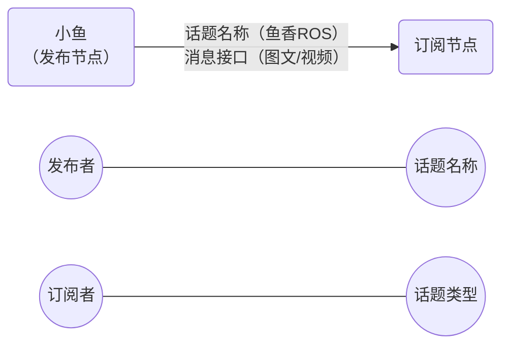

#topic



## python

```bash
# 增加依赖
ros2 pkg create demo_python_topic --build-type ament_python --dependencies rclpy example_interface --license Apache-2.0

# 查看接口
ros2 interface list | grep -i example
# 查看内容
ros2 interface  show example_interfaces/msg/String 

# 查看话题内容
ros2 topic echo /novel
# 查看话题频率
ros2 topic hz /novel
```

## c++

```bash
# 注意路径
cofallen@cofallen-NucBox-M6:~/Code/ros2/cp3_topic/topic_ws/src$ ros2 pkg create demo_cpp_topic --build-type ament_cmake --dependencies rclcpp geometry_msgs turtlesim --license Apache-2.0
```

```bash
# 查看话题发布情况
cofallen@cofallen-NucBox-M6:~$ ros2 topic list
/parameter_events
/rosout
/turtle1/cmd_vel
/turtle1/color_sensor
/turtle1/pose
cofallen@cofallen-NucBox-M6:~$ ros2 node list 
/turtle_circle
/turtlesim
cofallen@cofallen-NucBox-M6:~$ ros2 node info /turtle_circle 
/turtle_circle
  Subscribers:
    /parameter_events: rcl_interfaces/msg/ParameterEvent
  Publishers:
    /parameter_events: rcl_interfaces/msg/ParameterEvent
    /rosout: rcl_interfaces/msg/Log
    /turtle1/cmd_vel: geometry_msgs/msg/Twist   # 发布者
  Service Servers:
    /turtle_circle/describe_parameters: rcl_interfaces/srv/DescribeParameters
    /turtle_circle/get_parameter_types: rcl_interfaces/srv/GetParameterTypes
    /turtle_circle/get_parameters: rcl_interfaces/srv/GetParameters
    /turtle_circle/list_parameters: rcl_interfaces/srv/ListParameters
    /turtle_circle/set_parameters: rcl_interfaces/srv/SetParameters
    /turtle_circle/set_parameters_atomically: rcl_interfaces/srv/SetParametersAtomically
  Service Clients:

  Action Servers:

  Action Clients:

cofallen@cofallen-NucBox-M6:~$ ros2 topic echo /turtle1/cmd_vel
linear:
  x: 1.0
  y: 0.0
  z: 0.0
angular:
  x: 0.0
  y: 0.0
  z: 0.5
---
linear:
  x: 1.0
  y: 0.0
  z: 0.0
angular:
  x: 0.0
  y: 0.0
  z: 0.5
---
linear:
  x: 1.0
  y: 0.0
  z: 0.0
angular:
  x: 0.0
  y: 0.0
  z: 0.5
---
linear:
  x: 1.0
  y: 0.0
  z: 0.0
angular:
  x: 0.0
  y: 0.0
  z: 0.5
---
linear:
  x: 1.0
  y: 0.0
  z: 0.0
angular:
  x: 0.0
  y: 0.0
  z: 0.5
---
```