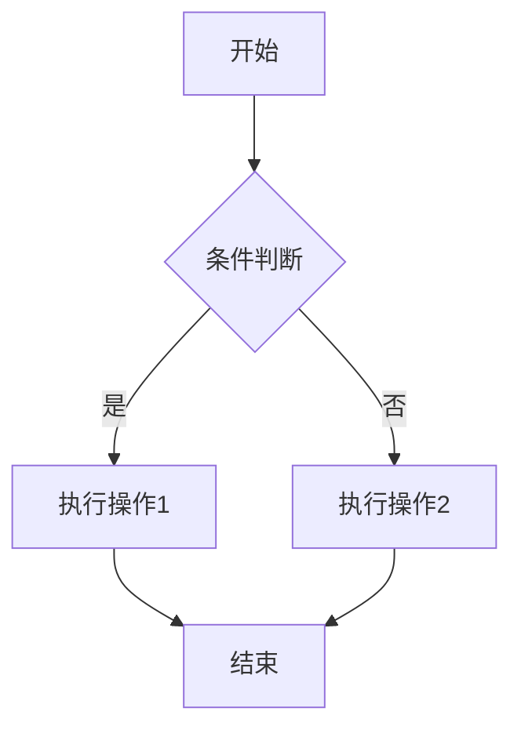
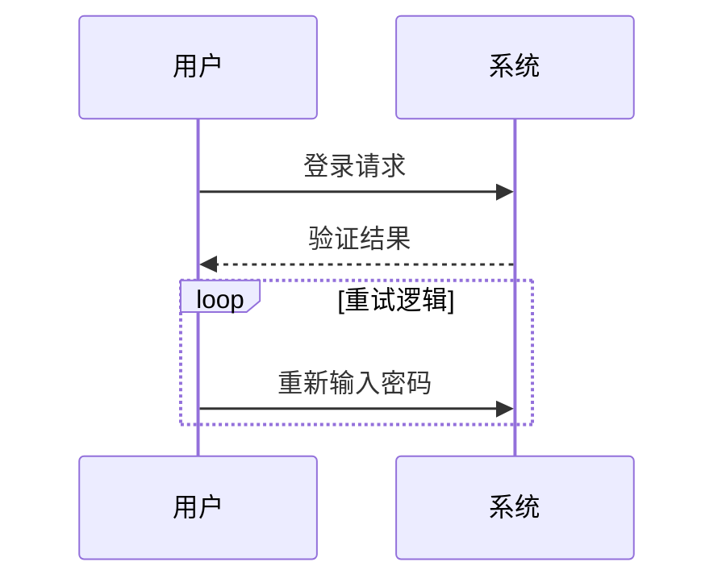
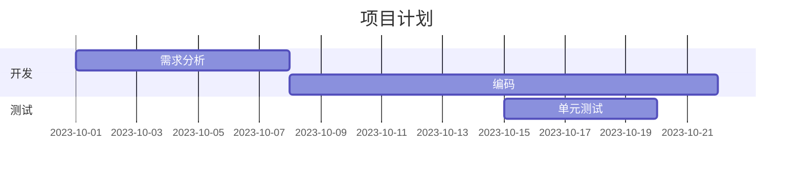
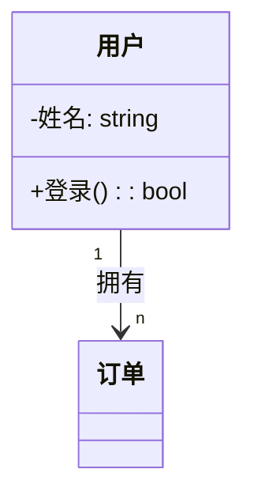
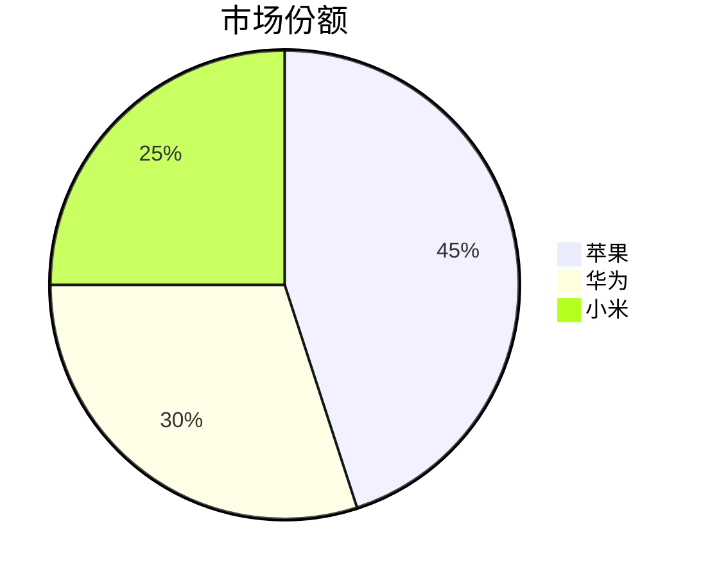
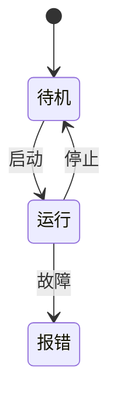

以下是 **Mermaid** 常见语法总结，满足日常使用需求（如流程图、时序图、甘特图等）：

---

### 一、流程图（Flowchart）

**语法要点：**
- **方向**：`TD`（从上到下）、`LR`（从左到右）、`BT`（从下到上）、`RL`（从右到左）
- **节点类型**：
  - `A[矩形]`  
  - `B{菱形条件}`  
  - `C(圆角矩形)`  
  - `D((圆形))`
- **连线**：
  - `-->` 实线箭头  
  - `---` 实线无箭头  
  - `-.->` 虚线箭头  
  - `-- 文字 -->` 带文字连线

---

### 二、时序图（Sequence Diagram）

**语法要点：**
- **参与者**：`participant 名称`
- **消息类型**：
  - `->>` 实线箭头（请求）  
  - `-->>` 虚线箭头（响应）  
  - `->x` 错误箭头
- **控制逻辑**：
  - `loop 循环` ... `end`  
  - `alt 条件` ... `else` ... `end`  
  - `opt 可选` ... `end`

---

### 三、甘特图（Gantt Chart）

**语法要点：**
- **时间格式**：`dateFormat` 定义日期格式（如 `YYYY-MM-DD`）
- **任务**：`任务名称 :id, start, duration`
- **依赖**：用 `after id` 表示任务顺序
- **分组**：`section 组名` 划分模块

---

### 四、类图（Class Diagram）

**语法要点：**
- **类定义**：`class 类名 { 字段/方法 }`  
  - `+` 公有，`-` 私有，`#` 保护
- **关系**：
  - `-->` 关联  
  - `--|>` 继承  
  - `*--` 组合  
  - `o--` 聚合

---

### 五、饼图（Pie Chart）

**语法要点**：直接按 `"标签": 数值` 分配比例。

---

### 六、状态图（State Diagram）

**语法要点**：
- `[*]` 初始/结束状态  
- `状态 --> 状态 : 事件` 表示转换

---

### 注意事项：
1. **缩进**：部分图表（如甘特图）对缩进敏感。
2. **注释**：用 `%%` 添加注释（不会渲染）。
3. **在线编辑器**：推荐使用 [Mermaid Live Editor](https://mermaid.live/) 调试。

掌握以上语法可覆盖 80% 的日常使用场景！